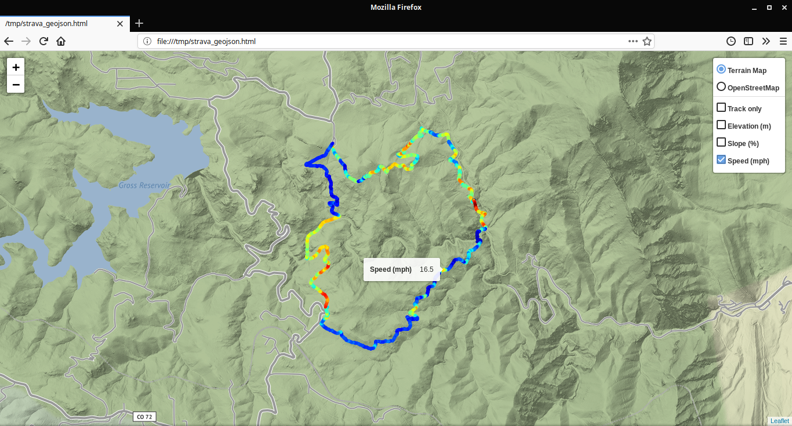

# Strava-to-GeoJSON
Python script to retrive the (speed, power, elevation, slope) from Strava GPX files and export to GeoJSON

Optimized for cycling :bicyclist: activities

## Features

* Calculate the slope and speed from the GPX data
* Export the (speed, power, elevation, slope) data to a color-coded GeoJSON file
* Compatible with [geojson.io](http://geojson.io) and [umap.openstreetmap.fr](https://umap.openstreetmap.fr)

## Example

Click to open the interactive map:  
[](https://github.com/remisalmon/Strava-to-GeoJSON/blob/master/Example/example.geojson)

## Usage

* Download the GPX file of your Strava activity  
(see https://support.strava.com/hc/en-us/articles/216918437-Exporting-your-Data-and-Bulk-Export#GPX)
* Run `python3 strava_geojson.py`
* Upload the `.geojson` file to [geojson.io](http://geojson.io) (Open->File) or [umap.openstreetmap.fr](https://umap.openstreetmap.fr) (Create a map->Import data)

## Python dependencies

```
python >= 3.7.1
matplotlib >= 3.0.2
numpy >= 1.15.4
scipy >= 1.1.0
geojson >= 2.4.1
```

## Todo:

* Add power calculation
* Add command-line arguments
